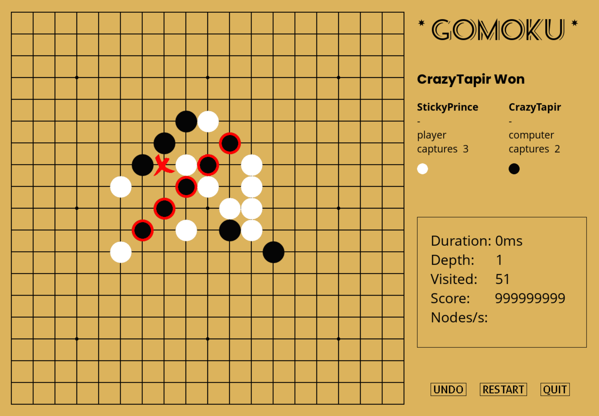
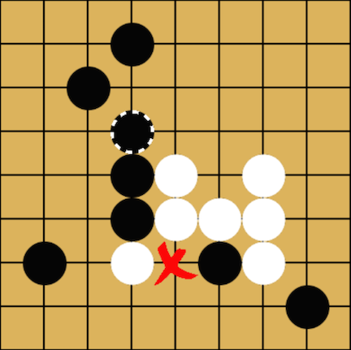

# Gomoku

Gomoku is a Codam/42 group project based on the board game Go.

[subject](https://github.com/flintlouis/gomoku/blob/gui/info/Gomoku.en.subject.pdf)



## Installation

Use requirements.txt to install the right dependencies.

```bash
xargs brew install < requirements.txt
```

## Usage

### Build
```bash
cmake . -Bbuild
cmake --build build
```
### Run
```bash
./bin.gomoku -h
Usage: Gomoku [options]

Optional arguments:
-h --help    	shows help message and exits [default: false]
-v --version 	prints version information and exits [default: false]
-s --size    	GUI size (big|medium|small) [default: "big"]
-r --replay  	Replay game from log (starting board: log/(id).board.data)
```

### Ai

Toggle ai by pressing 'player/computer' text.


## Rules
First player to get five in a row in any direction wins.
### Additional rules
• Capture (As in the Ninuki-renju or Pente variants) : You can remove a pair of your opponent’s stones from the board by flanking them with your own stones. This rule adds a win condition : If you manage to capture ten of your opponent’s stones, you win the game.

• Game-ending capture : A player that manages to align five stones only wins if the opponent can not break this alignment by capturing a pair, or if he has already lost four pairs and the opponent can capture one more, therefore winning by capture. There is no need for the game to go on if there is no possibility of this happening.

• No double-threes : It is forbidden to play a move that introduces two free-three alignments, which would guarantee a win by alignment. Marked on the board by a red cross.




## License
[MIT](https://choosealicense.com/licenses/mit/)
